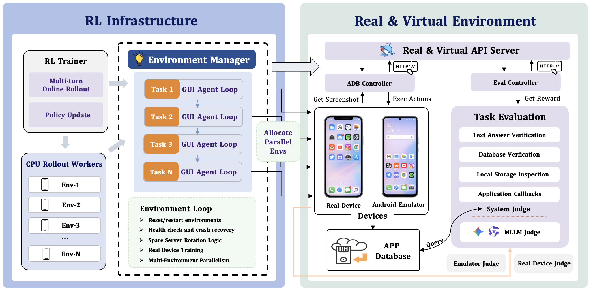
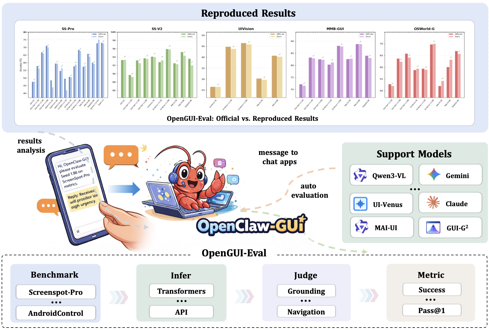

<div align="center">


<h1>ClawGUI: Build, Evaluate, and Deploy GUI Agents</h1>

[](https://www.python.org/downloads/release/python-3120/)
[](https://opensource.org/licenses/Apache-2.0)
[](https://github.com/ZJU-REAL/ClawGUI/stargazers)
[](https://huggingface.co/SugarVapeur/OpenGUI-2B)
[](https://www.modelscope.cn/models/SugarFree/OpenGUI-2B)

[English](README.md) | [中文](README_zh.md)

</div>

---

<div align="center">
<b>A unified research framework: train GUI agents with RL, measure them rigorously, deploy them on real devices.</b>
<table>
<tr>
<td align="center">
<video src="https://github.com/user-attachments/assets/cca75b33-4786-4f73-8c3f-ac3277831111" controls width="320"></video>
<br><b>ClawGUI-Agent Researches and Summarizes a Singer's Controversy</b>
</td>
<td align="center">
<video src="https://github.com/user-attachments/assets/75a6e68d-8880-4e77-9135-a409f1de787c" controls width="320"></video>
<br><b>ClawGUI-Agent Helps Users Troubleshoot Network Issues</b>
</td>
</tr>
<tr>
<td align="center">
<video src="https://github.com/user-attachments/assets/bc486af2-23de-48d0-af30-aa7dbbd078a6" controls width="320"></video>
<br><b>ClawGUI-Agent Assists Users in Querying Train Ticket Information</b>
</td>
<td align="center">
<video src="https://github.com/user-attachments/assets/c7155c5d-cdda-4784-94ec-e791a992979e" controls width="320"></video>
<br><b>ClawGUI-Agent Urgently Assists Users with Evaluation Tasks</b>
</td>
</tr>
</table>
</div>

---

## News

+ [2026/4/8] ClawGUI is released — train with ClawGUI-RL (GiGPO), evaluate with ClawGUI-Eval, deploy with ClawGUI-Agent. ClawGUI-2B, a 2B agent trained end-to-end with this pipeline, hits **17.1** MobileWorld SR vs. the **11.1** baseline. See [Quick Start](#-quick-start).

## Table of Contents

- [Overview](#-overview)
- [Architecture](#️-architecture)
- [Quick Start](#-quick-start)
  - [ClawGUI-RL — Build](#-clawgui-rl--build)
  - [ClawGUI-Eval — Evaluate](#-clawgui-eval--evaluate)
  - [ClawGUI-Agent — Deploy](#-clawgui-agent--deploy)
- [Roadmap](#️-roadmap)
- [Acknowledgements](#-acknowledgements)
- [License](#-license)

---

## 💡 Overview

**ClawGUI** is a research framework for GUI agents, covering the complete lifecycle from **online RL training** and **standardized evaluation** to **real-device deployment**.

Building a capable GUI agent involves three tightly coupled problems that are rarely solved together: you need an environment to train the agent online, rigorous benchmarks to measure what it has learned, and a production system to deploy it on real devices. ClawGUI addresses all three.

| Module | Role |
|--------|------|
| 🚀 **[ClawGUI-RL](clawgui-rl/)** | **Build** — Train GUI agents online with scalable RL: parallel Docker environments, real Android devices, and GiGPO+PRM for fine-grained step-level rewards |
| 📊 **[ClawGUI-Eval](clawgui-eval/)** | **Evaluate** — Measure what the agent has learned: 6 benchmarks, 11+ models, 95.8% faithful reproduction of official results |
| 🤖 **[ClawGUI-Agent](clawgui-agent/)** | **Deploy** — Use GUI agents in the real world: control mobile devices via natural language through 12+ chat platforms, with one-command evaluation built in |
| 🏆 **ClawGUI-2B** | End-to-end validation: trained entirely with ClawGUI-RL and GiGPO, achieving **17.1** MobileWorld SR vs. the **11.1** baseline |

---

## 🏗️ Architecture

<div align="center">

</div>

---

## 🚀 Quick Start

```bash
git clone https://github.com/ZJU-REAL/ClawGUI.git
cd ClawGUI
```

Each module is independent with its own environment. Click into each one for full installation and usage instructions.

---

### 🚀 ClawGUI-RL — Build

> 📁 [`clawgui-rl/`](clawgui-rl/) · 📖 [Full Documentation](clawgui-rl/README.md)

ClawGUI-RL trains GUI agents with online reinforcement learning. It runs dozens of Docker-based Android emulators in parallel or trains directly on physical devices — and replaces standard GRPO with GiGPO+PRM for fine-grained step-level rewards that drive stronger policy learning.

- **Parallel multi-environment** — Dozens of Docker-based virtual Android environments simultaneously
- **Real-device training** — Physical or cloud Android phones with the same API
- **GiGPO + PRM** — Fine-grained step-level reward for better policy optimization than standard GRPO
- **Spare server rotation** — Automatic failover keeps training running without interruption
- **Episode visualization** — Record and replay any training trajectory

<div align="center">

</div>

→ **[Get started with ClawGUI-RL](clawgui-rl/README.md)**

---

### 📊 ClawGUI-Eval — Evaluate

> 📁 [`clawgui-eval/`](clawgui-eval/) · 📖 [Full Documentation](clawgui-eval/README.md) · [🤗 Dataset](https://huggingface.co/datasets/johnzqlu/clawgui-eval) · [🤖 ModelScope](https://modelscope.cn/datasets/Matrix0602/clawgui-eval)

ClawGUI-Eval gives GUI grounding research a reliable measurement baseline. Its three-stage **Infer → Judge → Metric** pipeline covers 6 benchmarks and 11+ models, with a **95.8%** reproduction rate against official results — so numbers across papers are actually comparable.

- **6 benchmarks** — ScreenSpot-Pro, ScreenSpot-V2, UIVision, MMBench-GUI, OSWorld-G, AndroidControl
- **11+ models** — Qwen3-VL, Qwen2.5-VL, UI-TARS, MAI-UI, GUI-G2, UI-Venus, Gemini, Seed 1.8, and more
- **Dual backend** — Local GPU (`transformers`) or remote API (OpenAI-compatible)
- **Multi-GPU & multi-thread** — Parallel inference with automatic resume
- **ClawGUI-Agent integration** — Pair with ClawGUI-Agent to run the full pipeline via natural language

<div align="center">

</div>

→ **[Get started with ClawGUI-Eval](clawgui-eval/README.md)**

---

### 🤖 ClawGUI-Agent — Deploy

> 📁 [`clawgui-agent/`](clawgui-agent/) · 📖 [Full Documentation](clawgui-agent/README.md) · [English](clawgui-agent/README_EN.md)

ClawGUI-Agent closes the loop from training to production. Built on OpenClaw and powered by nanobot, it lets you control Android, HarmonyOS, or iOS devices with natural language from 12+ chat platforms — and trigger the full ClawGUI-Eval benchmark pipeline with a single sentence, no scripts required.

- **Cross-platform** — Android (ADB), HarmonyOS (HDC), iOS (XCTest)
- **Multi-model** — AutoGLM, MAI-UI, GUI-Owl, Qwen-VL, UI-TARS via OpenAI-compatible API
- **One-command evaluation** — Say "benchmark qwen3vl on screenspot-pro" and it handles env check → multi-GPU inference → judging → metrics → result comparison
- **Personalized memory** — Automatically learns user preferences and injects context across tasks
- **Episode recording** — Every task saved as structured episodes for replay and dataset building
- **Web UI** — Gradio interface for device management, task execution, and memory inspection

<div align="center">

</div>

→ **[Get started with ClawGUI-Agent](clawgui-agent/README.md)**

---

## 🎯 Roadmap

- [x] **ClawGUI-Agent** — GUI agent framework for phone control and evaluation via natural language
- [x] **ClawGUI-RL** — Scalable mobile online RL training infrastructure with GiGPO + PRM
- [x] **ClawGUI-Eval** — Standardized GUI grounding evaluation suite with 6 benchmarks and 95%+ reproduction rate
- [x] **ClawGUI-2B** — 2B GUI agent trained with GiGPO, achieving 17.1 MobileWorld SR (vs. 11.1 baseline)
- [ ] **On-device ClawGUI-Agent** — Deploy ClawGUI-Agent directly on real phones to avoid cloud-based privacy leakage
- [ ] **Desktop Online RL** — Extend ClawGUI-RL to desktop environments for online reinforcement learning
- [ ] **Web Online RL** — Extend ClawGUI-RL to web environments for online reinforcement learning
- [ ] **More Skills for ClawGUI-Agent** — Add more pluggable skills to expand ClawGUI-Agent's capabilities
- [ ] **Hybrid CLI & GUI Mechanism** — Explore hybrid interaction combining command-line and GUI operations
- [ ] **Real-time RL** — Integrate real-time reinforcement learning based on the OPD algorithm for ClawGUI-RL and ClawGUI-Agent

---

## 🙏 Acknowledgements

ClawGUI is built upon the following excellent open-source projects. We sincerely thank their contributors:

- [**verl-agent**](https://github.com/langfengq/verl-agent)
- [**MAI-UI**](https://github.com/Tongyi-MAI/MAI-UI)
- [**MobileWorld**](https://github.com/Tongyi-MAI/MobileWorld)
- [**Mobile-Agent**](https://github.com/x-plug/mobileagent)
- [**nanobot**](https://github.com/HKUDS/nanobot)
- [**Open-AutoGLM**](https://github.com/zai-org/Open-AutoGLM)

---

## License

This project is licensed under the [Apache License 2.0](LICENSE).
