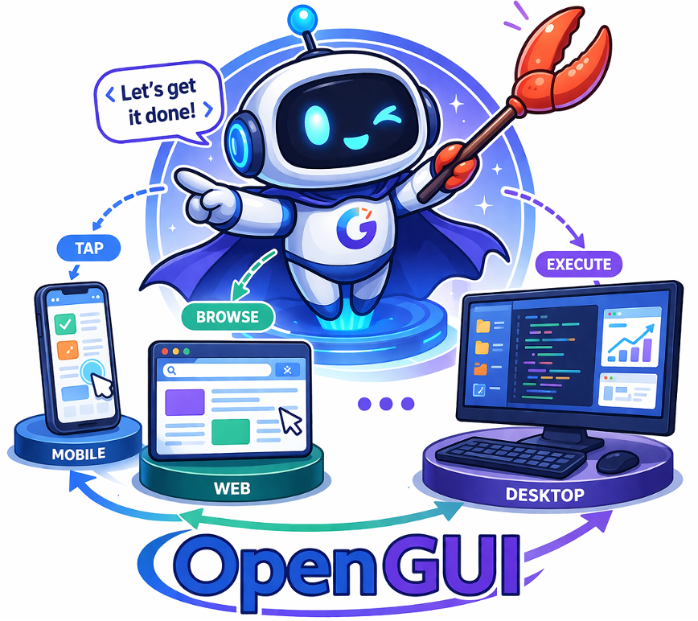
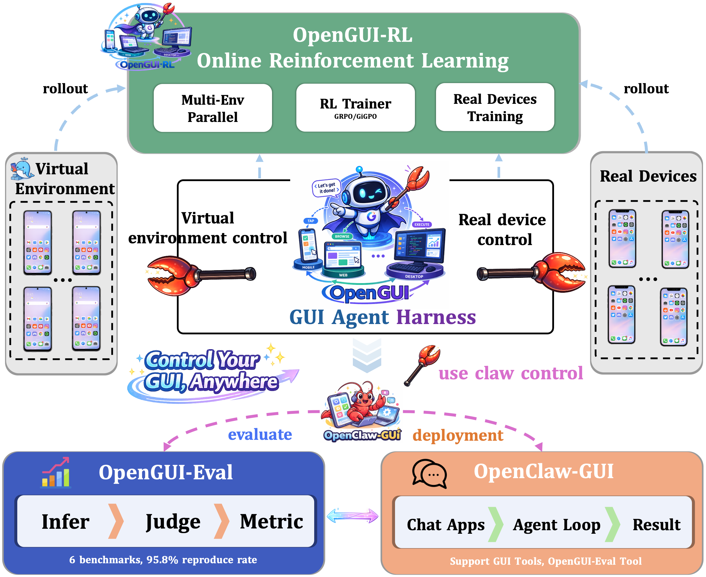

<div align="center">

<h1>
  
  OpenGUI: A Unified GUI Agent Harness
</h1>

[](https://www.python.org/downloads/release/python-3120/)
[](https://opensource.org/licenses/Apache-2.0)
[](https://github.com/sugarandgugu/OpenGUI/stargazers)
[](https://huggingface.co/)
[](https://modelscope.cn/)

[English](README.md) | [中文](README_zh.md)

</div>

---

## 📚 Table of Contents

- [Overview](#-overview)
- [Architecture](#️-architecture)
- [Quick Start](#-quick-start)
  - [OpenClaw-GUI — Agent Inference](#-openclaw-gui--agent-inference)
  - [OpenGUI-RL — Online RL Training](#-opengui-rl--online-rl-training)
  - [OpenGUI-Eval — Evaluation](#-opengui-eval--evaluation)
- [Acknowledgements](#-acknowledgements)

---

## 🎬 Demo: Natural Language-Driven GUI Evaluation

<div align="center">

<video src="assets/opengui-eval-demo.mp4" width="85%" controls></video>

</div>

---

## 📖 Overview

**OpenGUI** is a full-stack, end-to-end agent harness system for GUI intelligence. It covers the complete lifecycle of a GUI agent — from **inference and deployment**, through **standardized evaluation**, to **online reinforcement learning training** — providing researchers and engineers with a unified, production-ready infrastructure.

| Module | Description |
|--------|-------------|
| 🤖 **[OpenClaw-GUI](openclaw-gui/)** | GUI agent framework — control mobile devices via natural language through 12+ chat platforms, and launch standardized GUI model evaluation with a single command |
| 🚀 **[OpenGUI-RL](opengui-rl/)** | Scalable online RL training infrastructure — parallel multi-environment training, real-device support, GiGPO with PRM, robust spare-server rotation |
| 📊 **[OpenGUI-Eval](opengui-eval/)** | Standardized GUI grounding evaluation suite — 6 benchmarks, 11+ models, 95%+ faithful reproduction of official results |
| 🏆 **OpenGUI-2B** | State-of-the-art 2B GUI agent trained with GiGPO, achieving **17.1** MobileWorld SR |

---

## 🏗️ Architecture

<div align="center">

</div>

---

## 🚀 Quick Start

```bash
git clone https://github.com/sugarandgugu/OpenGUI.git
cd OpenGUI
```

OpenGUI consists of three independent modules. Click into each one for full installation and usage instructions.

---

### 🤖 OpenClaw-GUI — Agent Inference & Evaluation

> 📁 [`openclaw-gui/`](openclaw-gui/) · 📖 [Full Documentation](openclaw-gui/README.md) · [English](openclaw-gui/README_EN.md)

OpenClaw-GUI is a GUI agent framework built on OpenClaw, providing two core capabilities: **GUI phone control** and **GUI model evaluation**. Control mobile devices with natural language through 12+ chat platforms, or launch standardized opengui-eval benchmarks with a single command.

- 📱 **Cross-platform** — Android (ADB), HarmonyOS (HDC), iOS (XCTest)
- 🤖 **Multi-model** — AutoGLM, MAI-UI, GUI-Owl, Qwen-VL, UI-TARS via OpenAI-compatible API
- 📊 **One-command evaluation** — Built-in opengui-eval skill: say "benchmark qwen3vl on screenspot-pro" and it handles env check → multi-GPU inference → judging → metrics → result comparison
- 🧠 **Personalized memory** — Automatically learns user preferences and injects context across tasks
- 📝 **Episode recording** — Every task saved as structured episodes for replay and dataset building
- 🖥️ **Web UI** — Gradio interface for device management, task execution, and memory inspection

<div align="center">

</div>

→ **[Get started with OpenClaw-GUI](openclaw-gui/README.md)**

---

### 🚀 OpenGUI-RL — Online RL Training

> 📁 [`opengui-rl/`](opengui-rl/) · 📖 [Full Documentation](opengui-rl/README.md)

OpenGUI-RL is a scalable online RL infrastructure for GUI agent training, supporting both virtual environment scaling and real-device training.

- 🌐 **Parallel multi-environment** — Dozens of Docker-based virtual Android environments simultaneously
- 📱 **Real-device training** — Physical or cloud Android phones
- 🏆 **GiGPO + PRM** — Fine-grained step-level reward for better policy optimization than standard GRPO
- ♻️ **Spare server rotation** — Automatic failover keeps training running without interruption
- 🎬 **Episode visualization** — Record and replay any training trajectory

<div align="center">

</div>

→ **[Get started with OpenGUI-RL](opengui-rl/README.md)**

---

### 📊 OpenGUI-Eval — Evaluation

> 📁 [`opengui-eval/`](opengui-eval/) · 📖 [Full Documentation](opengui-eval/README.md) · [🤗 Dataset](https://huggingface.co/datasets/johnzqlu/opengui-eval) · [🤖 ModelScope](https://modelscope.cn/datasets/Matrix0602/opengui-eval)

OpenGUI-Eval is a standardized GUI grounding evaluation framework with a three-stage **Infer → Judge → Metric** pipeline and a **95.8%** reproduction rate against official results.

- 📊 **6 benchmarks** — ScreenSpot-Pro, ScreenSpot-V2, UIVision, MMBench-GUI, OSWorld-G, AndroidControl
- 🤖 **11+ models** — Qwen3-VL, Qwen2.5-VL, UI-TARS, MAI-UI, GUI-G2, UI-Venus, Gemini, Seed 1.8, and more
- 🔌 **Dual backend** — Local GPU (`transformers`) or remote API (OpenAI-compatible)
- ⚡ **Multi-GPU & multi-thread** — Parallel inference with automatic resume
- 🤖 **OpenClaw-GUI integration** — Pair with OpenClaw-GUI to run the full pipeline via natural language

<div align="center">

</div>

→ **[Get started with OpenGUI-Eval](opengui-eval/README.md)**

---

## 🙏 Acknowledgements

OpenGUI is built upon the following excellent open-source projects. We sincerely thank their contributors:

- [**verl-agent**](https://github.com/langfengq/verl-agent) 
- [**MAI-UI**](https://github.com/Tongyi-MAI/MAI-UI) 
- [**MobileWorld**](https://github.com/Tongyi-MAI/MobileWorld) 
- [**Mobile-Agent**](https://github.com/x-plug/mobileagent) 
- [**nanobot**](https://github.com/HKUDS/nanobot) 
- [**Open-AutoGLM**](https://github.com/zai-org/Open-AutoGLM) 

---

## 📄 License

This project is licensed under the [Apache License 2.0](LICENSE).
