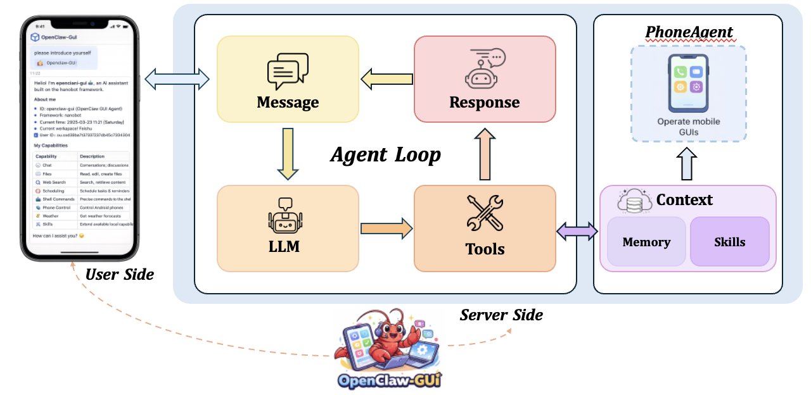

<div align="center">
  <h1>OpenClaw-GUI：基于 OpenClaw 的 GUI Agent 框架</h1>
  <p>
    
    
    
  </p>
</div>

---

**OpenClaw-GUI** 是基于 [OpenClaw](https://github.com/openclaw/openclaw) 的 GUI Agent 框架，通过集成 [nanobot](https://github.com/HKUDS/nanobot) 个人 AI 助手，让用户可以在飞书、钉钉、Telegram 等聊天平台上，用自然语言远程操控手机完成各种任务。框架底层利用视觉语言模型（VLM）理解屏幕内容、规划并执行 GUI 操作（点击、滑动、输入等），形成"截屏 → 推理 → 操作"的闭环自动化。

## 📑 目录

- [核心特性](#-核心特性)
- [架构](#-架构)
- [快速开始](#-快速开始)
- [配置](#-配置)
- [运行](#-运行)
- [Web UI](#-web-ui)
- [记忆系统](#-记忆系统)
- [支持的模型](#-支持的模型)
- [目录结构](#-目录结构)
- [许可证](#-许可证)

## ✨ 核心特性

💬 **nanobot 集成** — 通过飞书 / 钉钉 / Telegram / Discord / Slack / QQ 等 12+ 聊天平台远程控制手机，随时随地下发任务

📱 **OpenClaw 手机操控** — 基于 OpenClaw 能力，AI 自主截屏、理解屏幕、执行点击/滑动/输入等 GUI 操作，完成复杂任务

🧠 **多模型适配** — 支持 AutoGLM、Qwen VL、UI-TARS、MAI-UI、GUI-Owl 等多种 VLM，通过 OpenAI 兼容 API 接入

💾 **个性化记忆** — 自动学习用户偏好（联系人、常用 App、习惯），基于向量搜索的持久化记忆系统

📝 **Episode 实时记录** — 每次任务执行过程（截图 + 模型输出 + 动作）以结构化 episode 形式保存，便于回放与数据集构建

🖥️ **Web UI** — 提供 Gradio Web 界面，支持设备管理、任务执行可视化、手动接管、记忆管理等

## 🏗️ 架构

<p align="center">
  
</p>

## 🚀 快速开始

### 环境要求

- **Python**：≥ 3.10（nanobot 需要 ≥ 3.11）
- **包管理器**：推荐使用 [uv](https://github.com/astral-sh/uv)

### 1. 安装

假设你已经 clone 了 OpenGUI 项目并处于根目录：

```bash
cd openclaw-gui

# 创建虚拟环境
uv venv .venv

# 激活虚拟环境
source .venv/bin/activate

# 安装 phone_agent
uv pip install -e .

# 安装 nanobot
uv pip install -e nanobot/
```

### 2. 初始化配置

```bash
nanobot onboard
```

查看生成的配置文件：

```bash
cat ~/.nanobot/config.json
```

### 3. 连接 Android 设备

#### Step 1: 安装 ADB

下载官方 [ADB platform-tools](https://developer.android.com/tools/releases/platform-tools) 并解压。

**macOS / Linux：**

```bash
# 假设解压到 ~/Downloads/platform-tools
export PATH=${PATH}:~/Downloads/platform-tools
```

**Windows：** 请参考 [官方指南](https://developer.android.com/tools/releases/platform-tools) 配置环境变量。

#### Step 2: 连接手机并开启 USB 调试

1. **开启开发者模式**：进入 设置 > 关于手机 > 版本号，连续快速点击约 10 次，直到看到"您已处于开发者模式"提示
2. **开启 USB 调试**：进入 设置 > 开发者选项 > USB 调试，启用它（部分设备可能需要重启）
3. **验证连接**：

```bash
adb devices

# 预期输出：
# List of devices attached
# <your_device_id>   device
```

#### Step 3: 安装 ADB Keyboard（可选）

ADB Keyboard 用于文字输入。下载 [ADBKeyboard.apk](https://github.com/senzhk/ADBKeyBoard/blob/master/ADBKeyboard.apk) 并安装到设备：

```bash
adb install ADBKeyboard.apk
adb shell ime enable com.android.adbkeyboard/.AdbIME
```

> 注意：此步骤为可选，框架会在需要时自动检测并提示安装。

#### 其他平台（鸿蒙 / iOS）

请参考 [Open-AutoGLM](https://github.com/zai-org/Open-AutoGLM) 的设备连接指南。

## ⚙️ 配置

### 编辑 nanobot 配置

运行 `nanobot onboard` 后，编辑 `~/.nanobot/config.json`，以下是一份参考配置：

```json
{
  "agents": {
    "defaults": {
      "workspace": "~/.nanobot/workspace",
      "model": "glm-5",
      "provider": "zhipu",
      "maxTokens": 8192,
      "contextWindowTokens": 131072,
      "temperature": 0.1,
      "maxToolIterations": 40
    }
  },
  "providers": {
    "zhipu": {
      "apiKey": "YOUR_ZHIPU_API_KEY",
      "apiBase": "https://open.bigmodel.cn/api/paas/v4/"
    },
    "openrouter": {
      "apiKey": "YOUR_OPENROUTER_API_KEY",
      "apiBase": "https://openrouter.ai/api/v1"
    }
  },
  "tools": {
    "gui": {
      "enable": true,
      "deviceType": "adb",
      "deviceId": null,
      "maxSteps": 50,
      "useExternalModel": true,
      "guiBaseUrl": "https://openrouter.ai/api/v1",
      "guiApiKey": "YOUR_OPENROUTER_API_KEY",
      "guiModelName": "qwen/qwen3.5-35b-a3b",
      "promptTemplateLang": "cn",
      "promptTemplateStyle": "autoglm",
      "traceEnabled": false,
      "traceDir": "gui_trace"
    },
    "exec": {
      "enable": true,
      "timeout": 60
    }
  }
}
```

#### GUI 工具参数说明

| 参数 | 说明 |
|------|------|
| `enable` | 是否启用 GUI 手机控制工具 |
| `deviceType` | 设备类型：`adb`（Android）或 `hdc`（鸿蒙） |
| `deviceId` | 指定设备 ID，`null` 则自动检测 |
| `maxSteps` | 单次任务最大执行步数 |
| `useExternalModel` | 是否使用外部 GUI 专用模型（推荐 `true`） |
| `guiBaseUrl` | GUI 模型的 API 地址 |
| `guiApiKey` | GUI 模型的 API Key |
| `guiModelName` | GUI 模型名称 |
| `promptTemplateLang` | 提示词语言：`cn` / `en` |
| `promptTemplateStyle` | 提示词风格：`autoglm` / `uitars` / `qwenvl` 等 |
| `traceEnabled` | 是否开启 Episode 记录 |
| `traceDir` | Episode 保存目录 |

> **使用 OpenRouter？** 需在 `providers.openrouter` 中填写 API Key 和 URL，并在 `agents.defaults` 中设置对应的 `model` 和 `provider`。

### 配置聊天平台

配置好后，需要设置聊天平台的机器人以接收消息。以下以**飞书**为例：

<!-- TODO: 飞书机器人配置教程 -->

*（飞书机器人配置教程待补充）*

## 🚀 运行

### 通过 nanobot 聊天控制手机

启动 nanobot gateway 服务：

```bash
nanobot gateway
```

启动后，即可在已配置的聊天平台（如飞书）中发送消息来操控手机，例如：

```
帮我打开微信给张三发消息说我晚点到
```

nanobot 会调用 `gui_execute` 工具，自动截屏 → VLM 推理 → 执行手机操作，循环直到任务完成。

## 🖥️ Web UI

同时，我们还提供了 Web UI 方式进行启动，直接运行：

```bash
python webui.py
```

默认在 `http://localhost:7860` 打开，支持：

- **设备管理**：连接/断开设备、查看设备状态
- **任务执行**：输入任务描述，实时查看截图和 AI 思考过程
- **手动接管**：遇到验证码等场景可切换手动操作
- **记忆管理**：查看/编辑/清除记忆数据
- **配置面板**：图形化设置模型参数

## 🧠 记忆系统

框架内置个性化记忆系统，在每次任务完成后自动从对话中提取有价值的信息（联系人、App 偏好、用户习惯等），以 JSON + numpy 向量嵌入的形式持久化存储在 `memory_db/` 目录下。下次执行相似任务时，相关记忆会自动注入上下文，实现更智能的个性化操作。支持多用户隔离。

## 🤖 支持的模型

框架通过适配器模式支持多种视觉语言模型：

| 模型 | 类型标识 | 来源 |
|------|----------|------|
| **AutoGLM-Phone-9B** | `AUTOGLM` | 智谱 AI |
| **Doubao-1.5-UI-TARS** | `UITARS` | 字节跳动 |
| **Qwen2.5-VL / Qwen3-VL** | `QWENVL` | 阿里云通义 |
| **MAI-UI** | `MAIUI` | 阿里云 |
| **GUI-Owl-7B/32B** | `GUIOWL` | mPLUG |

所有模型均通过 **OpenAI 兼容 API** 接入，可使用本地 vLLM / SGLang 部署，也可对接智谱 BigModel、阿里云百炼、OpenRouter 等云端服务。

## 📁 目录结构

```
OpenClaw-GUI/
├── main.py                      # CLI 命令行入口
├── webui.py                     # Gradio Web UI 入口
├── ios.py                       # iOS 专用 CLI 入口
├── setup.py                     # 包安装配置
├── requirements.txt             # Python 依赖
│
├── phone_agent/                 # 核心手机自动化包
│   ├── agent.py                 # PhoneAgent 主类
│   ├── agent_ios.py             # IOSPhoneAgent 类
│   ├── device_factory.py        # 设备类型工厂
│   ├── tracer.py                # Episode 执行追踪器
│   ├── config/                  # 配置与提示词
│   ├── model/                   # 模型客户端与适配器
│   ├── adb/                     # Android ADB 设备控制
│   ├── hdc/                     # 鸿蒙 HDC 设备控制
│   ├── xctest/                  # iOS XCTest 设备控制
│   ├── actions/                 # 动作处理器
│   └── memory/                  # 个性化记忆系统
│
├── nanobot/                     # nanobot 子项目
│   ├── nanobot/                 # nanobot 核心包
│   │   ├── agent/               # 智能体核心 + GUI 工具
│   │   ├── channels/            # 12+ 聊天平台集成
│   │   ├── providers/           # 20+ LLM 提供商适配
│   │   └── skills/              # 可插拔技能（含 gui-mobile）
│   ├── pyproject.toml
│   └── README.md
│
├── examples/                    # 使用示例
├── scripts/                     # 部署验证脚本
└── memory_db/                   # 记忆数据库（运行时生成）
```

## 📄 许可证

本项目采用 [Apache License 2.0](LICENSE) 许可证。nanobot 子项目采用 [MIT License](nanobot/LICENSE)。
