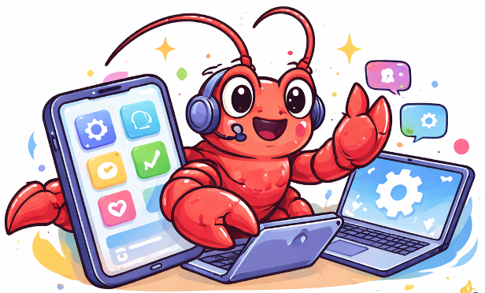

<div align="center">
  
</div>
<div align="center">
  <table style="border: none; border-collapse: collapse;">
    <tr>
      <td style="border: none; padding: 0;"></td>
      <td style="border: none; padding: 0 0 0 12px; vertical-align: middle;"><h1 style="margin: 0;">OpenClaw-GUI：个人手机 GUI 助手</h1></td>
    </tr>
  </table>
  <p>
    
    
    
  </p>
</div>

[English](README.md) | [中文](README_CN.md)

---

**OpenClaw-GUI** 是基于 [OpenClaw](https://github.com/openclaw/openclaw) 的 GUI Agent 框架，通过集成 [nanobot](https://github.com/HKUDS/nanobot) 个人 AI 助手，提供两大核心能力：**GUI 手机操控**和 **GUI 模型评测**。用户可以在飞书、QQ、Telegram 等聊天平台上用自然语言远程操控手机完成各种任务，也可以一句话启动 [opengui-eval](../opengui-eval) 标准化评测流程。框架底层利用视觉语言模型（VLM）理解屏幕内容、规划并执行 GUI 操作（点击、滑动、输入等），形成"截屏 → 推理 → 操作"的闭环自动化。

## 📑 目录

- [核心特性](#-核心特性)
- [架构](#-架构)
- [快速开始](#-快速开始)
- [运行](#-运行)
- [OpenGUI-Eval 评测](#-opengui-eval-评测)
- [GUI 手机操控能力](#-gui-手机操控能力)（Web UI / 记忆系统 / 支持的 GUI 模型）
- [目录结构](#-目录结构)
- [许可证](#-许可证)

## ✨ 核心特性

- 💬 **nanobot 集成** — 通过飞书 / 钉钉 / Telegram / Discord / Slack / QQ 等 12+ 聊天平台远程控制手机，随时随地下发任务

- 📱 **OpenClaw-GUI 手机操控** — 基于 OpenClaw 能力，AI 自主截屏、理解屏幕、执行点击/滑动/输入等 GUI 操作，完成复杂任务

- 📊 **OpenGUI-Eval 评测集成** — 内置 [opengui-eval](../opengui-eval) 评测技能，用自然语言一句话即可启动 GUI Grounding 模型评测（环境检测 → 多 GPU 推理 → 判分 → 指标计算），自动监控进度并汇报结果与官方基线对比

- 🧠 **多模型适配** — 支持 AutoGLM、Qwen VL、UI-TARS、MAI-UI、GUI-Owl 等多种 VLM，通过 OpenAI 兼容 API 接入

- 💾 **个性化记忆** — 自动学习用户偏好（联系人、常用 App、习惯），基于向量搜索的持久化记忆系统

- 📝 **Episode 实时记录** — 每次任务执行过程（截图 + 模型输出 + 动作）以结构化 episode 形式保存，便于回放与数据集构建

- 🖥️ **Web UI** — 提供 Gradio Web 界面，支持设备管理、任务执行可视化、手动接管、记忆管理等

## 🏗️ 架构

<p align="center">
  
</p>

## 🚀 快速开始

### 环境要求

- **Python**：≥ 3.11
- **包管理器**：推荐 [uv](https://github.com/astral-sh/uv)，也支持 conda + pip

### 1. 安装

假设你已经 clone 了 OpenGUI 项目并处于根目录：

#### 方式一：uv（推荐）

```bash
cd openclaw-gui

# 创建虚拟环境
uv venv .venv --python 3.12

# 激活虚拟环境
source .venv/bin/activate

# 安装 phone_agent
uv pip install -e .

# 安装 nanobot
uv pip install -e nanobot/
```

#### 方式二：conda + pip

```bash
cd openclaw-gui

# 创建 conda 环境
conda create -n opengui python=3.12 -y
conda activate opengui

# 安装 phone_agent
pip install -e .

# 安装 nanobot
pip install -e nanobot/
```

### 2. 初始化并编辑配置

运行 onboard 向导生成默认配置：

```bash
nanobot onboard
```

然后编辑 `~/.nanobot/config.json`，以下是一份参考配置：

> 我们推荐使用 **autoglm-phone** 作为外部的 GUI 模型进行手机操控调用。

```json
{
  "agents": {
    "defaults": {
      "workspace": "/path/to/OpenGUI",
      "model": "glm-5",
      "provider": "zhipu",
      "maxTokens": 8192,
      "contextWindowTokens": 131072,
      "temperature": 0.1,
      "maxToolIterations": 40
    }
  },
  "providers": {
    "zhipu": {
      "apiKey": "YOUR_ZHIPU_API_KEY",
      "apiBase": "https://open.bigmodel.cn/api/paas/v4/"
    },
    "openrouter": {
      "apiKey": "YOUR_OPENROUTER_API_KEY",
      "apiBase": "https://openrouter.ai/api/v1"
    }
  },
  "tools": {
    "gui": {
      "enable": true,
      "deviceType": "adb",
      "deviceId": null,
      "maxSteps": 50,
      "useExternalModel": true,
      "guiBaseUrl": "https://openrouter.ai/api/v1",
      "guiApiKey": "YOUR_OPENROUTER_API_KEY",
      "guiModelName": "qwen/qwen3.5-35b-a3b",
      "promptTemplateLang": "cn",
      "promptTemplateStyle": "autoglm",
      "traceEnabled": false,
      "traceDir": "gui_trace"
    },
    "exec": {
      "enable": true,
      "timeout": 60
    }
  }
}
```

> **重要：`workspace` 路径设置**
>
> 请将 `workspace` 设置为 OpenGUI 项目的根目录（即包含 `openclaw-gui/` 和 `opengui-eval/` 的目录）。这样 nanobot 内置的评测技能（opengui-eval）才能正确定位评测框架。例如，如果你的项目在 `/home/user/OpenGUI`，则设置为 `"/home/user/OpenGUI"`。
>


#### GUI 工具参数说明

| 参数 | 说明 |
|------|------|
| `enable` | 是否启用 GUI 手机控制工具 |
| `deviceType` | 设备类型：`adb`（Android）或 `hdc`（鸿蒙） |
| `deviceId` | 指定设备 ID，`null` 则自动检测 |
| `maxSteps` | 单次任务最大执行步数 |
| `useExternalModel` | 是否使用外部 GUI 专用模型（推荐 `true`） |
| `guiBaseUrl` | 外部 GUI 模型的 API 地址 |
| `guiApiKey` | 外部 GUI 模型的 API Key |
| `guiModelName` | 外部 GUI 模型名称，搭配 guiBaseUrl 使用 |
| `promptTemplateLang` | 提示词语言：`cn` / `en` |
| `promptTemplateStyle` | 提示词风格：`autoglm` / `uitars` / `qwenvl` 等 |
| `traceEnabled` | 是否开启 Episode 记录 |
| `traceDir` | Episode 保存目录 |


### 3. 连接 Android 设备

> 受控手机需要通过 USB/WIFI 等方式连接到安装了 OpenClaw-GUI 的服务端机器上。

#### Step 1: 安装 ADB

**方案 A：通过包管理器安装**

**macOS（推荐 brew）：**

```bash
brew install android-platform-tools
```

**Linux：**

```bash
sudo apt install android-tools-adb   # Ubuntu/Debian
```

**Windows：** 请参考此 [博客教程](https://blog.csdn.net/x2584179909/article/details/108319973) 下载并配置环境变量。

**方案 B：手动下载安装**

下载官方 [ADB platform-tools](https://developer.android.com/tools/releases/platform-tools) 并解压，然后将其添加到 PATH 环境变量：

**macOS / Linux：**

```bash
# 假设解压到 ~/Downloads/platform-tools
export PATH=${PATH}:~/Downloads/platform-tools
```

**Windows：** 将解压目录（如 `C:\platform-tools`）添加到系统 PATH 环境变量中。

#### Step 2: 连接手机并开启 USB 调试

1. **开启开发者模式**：进入 设置 > 关于手机 > 版本号，连续快速点击约 10 次，直到看到"您已处于开发者模式"提示
2. **开启 USB 调试**：进入 设置 > 开发者选项 > USB 调试，启用它（部分设备可能需要重启）
3. **验证连接**：

```bash
adb devices

# 预期输出：
# List of devices attached
# <your_device_id>   device
```

#### Step 3: 安装 ADB Keyboard（可选）

ADB Keyboard 用于文字输入。下载 [ADBKeyboard.apk](https://github.com/senzhk/ADBKeyBoard/blob/master/ADBKeyboard.apk) 并安装到设备：

```bash
adb install ADBKeyboard.apk
adb shell ime enable com.android.adbkeyboard/.AdbIME
```

> 注意：此步骤为可选，框架会在需要时自动检测并提示安装。

#### 其他平台（鸿蒙 / iOS）

请参考 [Open-AutoGLM](https://github.com/zai-org/Open-AutoGLM) 的设备连接指南。

### 4. 配置聊天平台（可选）

如需通过聊天平台远程控制手机，在 `config.json` 的 `channels` 中启用对应平台并填写凭证。以下是飞书和 QQ 的配置示例：

#### 飞书（Feishu / Lark）

<details>
<summary>📖 点击展开详细步骤</summary>

- **Step 1**：打开 [飞书开放平台](https://open.feishu.cn/)，在首页点击**创建应用**，选择**企业自建应用**，填入应用名称和应用描述，并启用**机器人**功能。
- **Step 2**：点击左侧的**权限管理**，点击**开通权限**。
- **Step 3**：在文本框搜索并开通以下权限：`im:message`、`im:message.p2p_msg:readonly`、`cardkit:card:write`
  > 如果无法添加 `cardkit:card:write`，请在下方配置的 `channels.feishu` 中设置 `"streaming": false`。机器人仍可正常工作；回复使用普通的交互式卡片，无需逐个令牌流式传输。
- **Step 4**：点击左侧的**事件与回调**，点击**订阅方式**，选择**长时间接受事件**（需要运行 openclaw-gui 建立连接）。
- **Step 5**：从左侧的**凭证和基础信息**找到 `App ID` 和 `App Secret`，拿到密钥。
- **Step 6**：点击**发布应用**。
- **Step 7**：打开飞书，随便进入一个群里，点击群聊的设置，点击**群机器人**，点击**添加机器人**，将刚刚创建的机器人加入群聊。
- **Step 8**：@机器人发送消息。

</details>

4. 最后在 `~/.nanobot/config.json` 中配置：

```json
"feishu": {
  "enabled": true,
  "appId": "YOUR_APP_ID",
  "appSecret": "YOUR_APP_SECRET",
  "encryptKey": "",
  "verificationToken": "",
  "allowFrom": ["*"],
  "groupPolicy": "mention"
}
```

> `allowFrom` 设为 `["*"]` 表示允许所有用户。如需限制，填入用户的 Open ID 列表。`groupPolicy` 设为 `"mention"` 表示在群聊中需 @机器人 才会响应。

#### QQ

1. 前往 [QQ 开放平台](https://q.qq.com/) 注册并创建机器人应用
2. 获取 `App ID` 和 `Secret`
3. 在 `~/.nanobot/config.json` 中配置：

```json
"qq": {
  "enabled": true,
  "appId": "YOUR_APP_ID",
  "secret": "YOUR_SECRET",
  "allowFrom": ["*"]
}
```

#### 其他平台

nanobot 还支持 Telegram、Discord、Slack、钉钉、企业微信、WhatsApp、Email 等 12+ 平台。在 `config.json` 的 `channels` 对应字段中设置 `"enabled": true` 并填写凭证即可。

## 🚀 运行

### 通过 nanobot 聊天控制手机

启动 nanobot gateway 服务：

```bash
nanobot gateway
```

启动后，即可在已配置的聊天平台（如飞书）中发送消息来操控手机，例如：

```
帮我打开微信给张三发消息说我晚点到
```

nanobot 会调用 `gui_execute` 工具，自动截屏 → VLM 推理 → 执行手机操作，循环直到任务完成。

## 📊 OpenGUI-Eval 评测

OpenClaw-GUI 内置了 [opengui-eval](../opengui-eval) 评测技能，可以用自然语言指令驱动 GUI Grounding 模型的标准化评测。

### 前置条件

1. **workspace 已正确设置**：`config.json` 中的 `workspace` 指向 OpenGUI 根目录（见上方配置说明）
2. **opengui-eval 环境已安装**：参考 [opengui-eval README](../opengui-eval/README_zh.md) 完成安装和数据下载
3. **GPU 可用**：推理需要 NVIDIA GPU
4. **（推荐）安装 FlashAttention-2**：`pip install flash-attn --no-build-isolation`，未安装时框架会自动降级为 SDPA，但精度可能略有下降

### 使用方式

在 nanobot 对话中直接说即可，例如：

```
帮我测一下 qwen3vl 2b 模型在 screenspot-pro 上的指标
```

```
用 MAI-UI-8B 跑一下 uivision 和 osworld-g 的评测
```

nanobot 会自动完成以下流程：

1. **环境检测** — 检查 GPU、CUDA、FlashAttention-2、数据完整性
2. **推理** — 基于模板脚本生成运行脚本，后台启动多 GPU 并行推理，实时监控进度
3. **判分** — 自动选择对应的 judge 脚本执行
4. **指标计算** — 自动选择对应的 metric 脚本执行
5. **结果汇报** — 展示准确率、分项指标，并与官方基线对比

### 支持的评测模型

| 模型类型 | 示例 HuggingFace ID |
|---------|-------------------|
| `qwen3vl` | Qwen/Qwen3-VL-2B/4B/8B-Instruct |
| `qwen25vl` | Qwen/Qwen2.5-VL-3B/7B-Instruct |
| `maiui` | Tongyi-MAI/MAI-UI-2B/8B |
| `uitars` | ByteDance-Seed/UI-TARS-1.5-7B |
| `uivenus15` | inclusionAI/UI-Venus-1.5-2B/8B |
| `guiowl15` | mPLUG/GUI-Owl-1.5-2B/4B/8B-Instruct |
| `guig2` | inclusionAI/GUI-G2-7B |
| `stepgui` | stepfun-ai/GELab-Zero-4B-preview |
| `uivenus` | inclusionAI/UI-Venus-Ground-7B |

支持的 Benchmark：ScreenSpot-Pro、ScreenSpot-V2、UIVision、MMBench-GUI、OSWorld-G、AndroidControl

---

## 📱 GUI 手机操控能力

以下功能均属于 OpenClaw-GUI 的手机/设备操控能力，通过 `gui_execute` 工具驱动。

你也可以通过以下方式直接通过命令行调用 GUI Agent：

```bash
python main.py \
  --base-url https://open.bigmodel.cn/api/paas/v4/ \
  --model autoglm-phone \
  --apikey <YOUR_API_KEY> \
  --max-steps 100 \
  --lang cn \
  "Open QQ Music, play Justin Bieber's Baby and add it to favorites. If it is already favorited, just play it. After it starts playing, pause it, then go back and play Bieber's Love Me."
```

### Web UI

除了通过聊天平台控制，还可以使用 Web UI 直接操控：

```bash
python webui.py
```

默认在 `http://localhost:7860` 打开，支持：

- **设备管理**：连接/断开设备、查看设备状态
- **任务执行**：输入任务描述，实时查看截图和 AI 思考过程
- **手动接管**：遇到验证码等场景可切换手动操作
- **记忆管理**：查看/编辑/清除记忆数据
- **配置面板**：图形化设置模型参数

### 记忆系统

框架内置个性化记忆系统，在每次任务完成后自动从对话中提取有价值的信息（联系人、App 偏好、用户习惯等），以 JSON + numpy 向量嵌入的形式持久化存储。下次执行相似任务时，相关记忆会自动注入上下文，实现更智能的个性化操作。支持多用户隔离。

### 支持的 GUI 模型

框架通过适配器模式支持多种视觉语言模型：

| 模型 | `promptTemplateStyle` | 来源 |
|------|----------------------|------|
| **AutoGLM-Phone-9B** | `autoglm` | 智谱 AI |
| **Doubao-1.5-UI-TARS** | `uitars` | 字节跳动 |
| **Qwen2.5-VL / Qwen3-VL** | `qwenvl` | 阿里云通义 |
| **MAI-UI** | `maiui` | 阿里云 |
| **GUI-Owl-7B/32B** | `guiowl` | mPLUG |

所有模型均通过 **OpenAI 兼容 API** 接入，可使用本地 vLLM / SGLang 部署，也可对接智谱 BigModel、阿里云百炼、OpenRouter 等云端服务。

---

## 📁 目录结构

```
OpenClaw-GUI/
├── main.py                      # CLI 命令行入口
├── webui.py                     # Gradio Web UI 入口
├── ios.py                       # iOS 专用 CLI 入口
├── setup.py                     # 包安装配置
├── requirements.txt             # Python 依赖
│
├── phone_agent/                 # 核心手机自动化包
│   ├── agent.py                 # PhoneAgent 主类
│   ├── agent_ios.py             # IOSPhoneAgent 类
│   ├── device_factory.py        # 设备类型工厂
│   ├── tracer.py                # Episode 执行追踪器
│   ├── config/                  # 配置与提示词
│   ├── model/                   # 模型客户端与适配器
│   ├── adb/                     # Android ADB 设备控制
│   ├── hdc/                     # 鸿蒙 HDC 设备控制
│   ├── xctest/                  # iOS XCTest 设备控制
│   ├── actions/                 # 动作处理器
│   └── memory/                  # 个性化记忆系统
│
├── nanobot/                     # nanobot 子项目
│   ├── nanobot/                 # nanobot 核心包
│   │   ├── agent/               # 智能体核心 + GUI 工具
│   │   ├── channels/            # 12+ 聊天平台集成
│   │   ├── providers/           # 20+ LLM 提供商适配
│   │   └── skills/              # 可插拔技能（含 gui-mobile、opengui-eval）
│   ├── pyproject.toml
│   └── README.md
│
├── examples/                    # 使用示例
└── scripts/                     # 部署验证脚本
```

## 📄 许可证

本项目采用 [Apache License 2.0](LICENSE) 许可证。nanobot 子项目采用 [MIT License](nanobot/LICENSE)。
