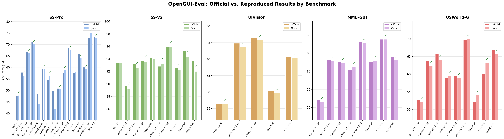

<div align="center">


# OpenGUI-Eval: A Unified GUI Evaluation Framework

[](https://www.python.org/downloads/release/python-3120/)
[](https://opensource.org/licenses/Apache-2.0)
[](https://huggingface.co/datasets/johnzqlu/opengui-eval)
[](https://modelscope.cn/datasets/Matrix0602/opengui-eval)

[English](README.md) | [中文](README_zh.md)

</div>

---

## 📚 Table of Contents

- [Overview](#-overview)
- [Architecture](#️-architecture)
- [Installation](#-installation)
- [Download Data](#-download-data)
- [Project Structure](#-project-structure)
- [Supported Benchmarks & Models](#-supported-benchmarks--models)
- [Reproduction Tips](#-reproduction-tips)
- [Quick Start](#-quick-start)
- [Script Parameters](#️-script-parameters)
- [Adding a New Model](#-adding-a-new-model)
- [Data Format](#-data-format)
- [Reproduction Results](#-reproduction-results)
- [Roadmap](#️-roadmap)
- [License](#-license)

---

## 📖 Overview

**OpenGUI-Eval** is a standardized evaluation framework for GUI grounding models. It adopts a three-stage pipeline — **Infer → Judge → Metric** — to evaluate how accurately a model can locate UI elements based on natural language instructions.

✨ **Key Features:**
- 🔌 **Dual backend support** — Local GPU via `transformers` or remote API via OpenAI-compatible endpoints
- 📊 **6 benchmarks** — ScreenSpot-Pro, ScreenSpot-V2, UIVision, MMBench-GUI, OSWorld-G, AndroidControl
- 🤖 **11+ models** — Qwen3-VL, Qwen2.5-VL, UI-TARS, MAI-UI, GUI-G2, UI-Venus, Gemini, Seed 1.8, and more
- ⚡ **Multi-GPU & multi-thread** — Parallel inference with automatic resume
- 🧩 **Easily extensible** — Add new models by inheriting a simple base class
- ✅ **Faithful reproduction** — Comprehensive reproduction results with detailed official vs. reproduced comparisons ([see details](#-reproduction-results))
- 🌐 **Frontier model evaluation** — Successfully reproduced Gemini 3.0 Pro and Seed 1.8 official results on ScreenSpot-Pro, and added Gemini 3.1 Pro evaluation

---

## 🏗️ Architecture

<div align="center">

</div>

<div align="center">

</div>

---

## 🔧 Installation

```bash
cd OpenGUI/opengui-eval
```

```bash
conda create -n opengui-eval python=3.12 -y
conda activate opengui-eval
pip install -r requirements.txt
pip install flash-attn==2.8.1 --no-build-isolation
# Optional: vLLM support
pip install vllm==0.11.0
```

> 💡 **Tip:** If building `flash-attn` from source is too slow, you can download a prebuilt wheel from the [flash-attn releases page](https://github.com/Dao-AILab/flash-attention/releases) and install it directly.

---

## 📥 Download Data

Benchmark images and data files are hosted on **Hugging Face** and **ModelScope**. Download them before running evaluations.

**From Hugging Face:**

```bash
pip install -U huggingface_hub

# If you have trouble accessing HF, use the mirror:
# export HF_ENDPOINT=https://hf-mirror.com

huggingface-cli download johnzqlu/opengui-eval --repo-type dataset --local-dir .
```

**From ModelScope:**

```bash
pip install -U modelscope

modelscope download --dataset Matrix0602/opengui-eval --local_dir .
```

Then extract the archives under the `opengui-eval/` directory:

```bash
cd opengui-eval
unzip image.zip
unzip data.zip
unzip output.zip
```

> ⚠️ **Important:** All zip files (`image.zip`, `data.zip`, `output.zip`) must be extracted under the `opengui-eval/` directory to ensure the relative paths resolve correctly.

| File | Contents |
|------|----------|
| `image.zip` | Benchmark images (`image/` directory) |
| `data.zip` | Benchmark data & prompt files (`data/` directory) |
| `output.zip` | Pre-computed inference & judge results (`output/` directory) |

---

## 📁 Project Structure

```
opengui-eval/
├── 📄 main.py                          # Inference entry point
├── 📂 inference/                        # Model inferencers
│   ├── base_inferencer.py               # Abstract base class
│   ├── qwen3vl_inferencer.py            # Qwen3-VL
│   ├── qwen25vl_inferencer.py           # Qwen2.5-VL
│   ├── maiui_inferencer.py              # MAI-UI
│   ├── stepgui_inferencer.py            # StepGUI
│   ├── guiowl15_inferencer.py           # GUI-Owl 1.5
│   ├── guig2_inferencer.py              # GUI-G2
│   ├── uitars_inferencer.py             # UI-TARS (extends Qwen2.5-VL)
│   ├── uivenus15_inferencer.py          # UI-Venus 1.5 (extends Qwen3-VL)
│   ├── uivenus_inferencer.py            # UI-Venus (extends GUI-G2)
│   ├── gemini_inferencer.py             # Gemini (API, optional Zoom)
│   └── seed_inferencer.py               # Seed 1.8 (API, optional Zoom)
├── 📂 judge/                            # Judgment module
│   ├── base_judge.py                    # Abstract base class
│   ├── grounding_judge.py               # Point-in-box judge (most benchmarks)
│   ├── osworld_g_judge.py               # OSWorld-G judge (bbox/polygon/refusal)
│   └── androidcontrol_judge.py          # AndroidControl judge (multi-action)
├── 📂 metric/                           # Metric calculation
│   ├── base_metric.py
│   ├── screenspotpro_metric.py
│   ├── screenspotv2_metric.py
│   ├── mmbenchgui_metric.py
│   ├── osworldg_metric.py
│   ├── uivision_metric.py
│   └── androidcontrol_metric.py
├── 📂 data/                             # Benchmark data & prompt injection
│   ├── convert_any_models.py            # Prompt injection script
│   └── *.json                           # Base & model-specific data files
├── 📂 scripts/
│   ├── infer/
│   │   ├── transformers/                # Local GPU inference scripts
│   │   ├── api/                         # API inference scripts
│   │   └── vllm_depoly/                 # vLLM server deployment
│   ├── judge/                           # Judge scripts (one per benchmark)
│   └── metric/                          # Metric scripts
├── 📂 image/                            # Benchmark images (downloaded)
└── 📂 output/                           # Inference & judge output
```

---

## 📊 Supported Benchmarks & Models

### Benchmarks

| Benchmark | ScreenSpot-Pro | ScreenSpot-V2 | UIVision | MMBench-GUI | OSWorld-G | AndroidControl |
|:---------:|:--------------:|:-------------:|:--------:|:-----------:|:---------:|:--------------:|
| Status    | ✅              | ✅             | ✅        | ✅           | ✅         | ✅              |

### Open-Source Models

| Model Key | Model Name | Architecture | Coordinate System | Input Order | System Prompt | ScreenSpot-Pro | ScreenSpot-V2 | UIVision | MMBench-GUI | OSWorld-G | AndroidControl |
|-----------|-----------|-------------|:-:|:-:|:-:|:-:|:-:|:-:|:-:|:-:|:-:|
| `qwen3vl` | Qwen3-VL | Standalone | `[0, 1000]` | `vt` | ✅ Required | ✅ | ✅ | ✅ | ✅ | ✅ | ✅ |
| `qwen25vl` | Qwen2.5-VL | Standalone | Absolute | `vt` | ✅ Required | ✅ | ✅ | ✅ | ✅ | ✅ | ✅ |
| `maiui` | MAI-UI | Standalone | `[0, 1000]` | `tv` | ✅ Required | ✅ | ✅ | ✅ | ✅ | ✅ | - |
| `stepgui` | StepGUI (GELab-Zero) | Standalone | `[0, 999]` | `vt` | ❌ None | ✅ | ✅ | ✅ | ✅ | ✅ | - |
| `guiowl15` | GUI-Owl 1.5 | Standalone | `[0, 1000]` | `vt` | ✅ Required | ✅ | ✅ | ✅ | ✅ | ✅ | - |
| `uitars` | UI-TARS 1.5 | Extends Qwen2.5-VL | Absolute (smart_resize) | `vt` | ❌ None | ✅ | ✅ | ✅ | ✅ | ✅ | - |
| `guig2` | GUI-G2 | Extends Qwen2.5-VL | `[0, 1000]` | `vt` | ❌ None | ✅ | ✅ | ✅ | ✅ | ✅ | - |
| `uivenus15` | UI-Venus 1.5 | Extends Qwen3-VL | `[0, 1000]` | `vt` | ❌ None | ✅ | ✅ | ✅ | ✅ | ✅ | - |
| `uivenus` | UI-Venus | Extends GUI-G2 | `[0, 1000]` | `vt` | ❌ None | ✅ | ✅ | ✅ | ✅ | ✅ | - |
| `gemini` | Gemini 3.x Pro | API (optional Zoom) | `[0, 1000]` | `tv` | ✅ Built-in | ✅ | - | - | - | - | - |
| `seed` | Seed 1.8 | API (optional Zoom) | `[0, 1000]` | `tv` | ✅ Built-in | ✅ | - | - | - | - | - |

### Frontier / Closed-Source Models

We have also reproduced GUI grounding results for frontier models on ScreenSpot-Pro using the **Zoom paradigm** (crop-then-ground). For details on the Zoom pipeline, see the [MAI-UI blog: A Practical Guide to GUI Grounding for Frontier Models](https://galvanized-jump-79a.notion.site/Why-your-AI-Agent-keeps-misclicking-A-Practical-Guide-to-GUI-Grounding-for-Frontier-Models-32630d140ad8808e895de98994dddb93).

| Model | Coordinate System | Zoom Paradigm | SS-Pro Official | SS-Pro Ours |
|-------|:-:|:-:|:-:|:-:|
| Gemini 3.1 Pro | `[0, 1000]` | ✅ | N/A | 85.01 |
| Gemini 3.0 Pro | `[0, 1000]` | ✅ | 72.70 | **75.08** ✅ |
| Seed 1.8 | `[0, 1000]` | ✅ | 73.10 | **72.80** ✅ |

> 📐 **Coordinate Systems:**
> - **Absolute** — Output is in raw pixel coordinates of the original (or smart_resize'd) image
> - **[0, 1000]** — Output is normalized to a 1000×1000 coordinate space, then mapped back to the original image
> - **[0, 1]** — Output is a ratio in [0, 1] relative to the original image dimensions
> - **[0, 999]** — Similar to [0, 1000] but with a 999 divisor

---

## 💡 Reproduction Tips

<details>
<summary><b>Click to expand 9 key lessons for faithful reproduction</b></summary>
<br>

#### 1. 🔀 Message Format (`tv_or_vt`)

Different models are **sensitive to the order of image and text** in the input message. Our framework provides the `TV_OR_VT` parameter to control this:
- `vt` = image first, then text (default for most models)
- `tv` = text first, then image (required by MAI-UI)

> ⚠️ Always align with the model's official implementation. Using the wrong order can cause significant accuracy drops.

#### 2. 🌡️ Temperature

For grounding tasks, **always set `TEMPERATURE=0.0`** (greedy decoding). Non-zero temperatures introduce randomness that hurts coordinate precision.

#### 3. 📝 Prompt Alignment

Most GUI grounding models are **highly sensitive to prompt format**. Ensure strict alignment with the official prompt template. Even minor wording differences can affect results. The `data/convert_any_models.py` script handles this for all supported models.

#### 4. 🖼️ Image Resolution (`MIN_PIXELS` / `MAX_PIXELS`)

Models are **sensitive to image resolution bounds**. Always match the official values:
- Different models use different default resolutions
- Changing these values can significantly shift accuracy

#### 5. 📊 Sampling Parameters (`TOP_P` / `TOP_K`)

These parameters have **minimal impact** on grounding results — typically ±0.1% fluctuation. Not a major concern for reproduction.

#### 6. 📐 Coordinate Systems

Understanding each model's output coordinate format is critical for correct parsing:
- **Qwen2.5-VL family** (qwen25vl, uitars) → outputs **absolute pixel coordinates**
- **Qwen3-VL family** (qwen3vl, guiowl15, uivenus15, maiui) → outputs **[0, 1000] normalized** coordinates
- **GUI-G2 family** (guig2, uivenus) → outputs **[0, 1000] normalized** bounding boxes
- **StepGUI** → outputs **[0, 999] normalized** coordinates

> 🔑 Mismatched coordinate parsing is the #1 cause of zero-accuracy results.

#### 7. 💬 System Prompt

The Qwen-VL series models are **notably sensitive** to system prompts:
- `qwen3vl`, `qwen25vl`, `guiowl15`, `maiui` → **require** a specific tool-call system prompt
- `uitars`, `guig2`, `uivenus`, `uivenus15`, `stepgui` → inject prompts into the user question instead

> Set `SYSTEM_PROMPT="call_user"` for models that require it; the prompt content is pre-injected into the data files.

#### 8. 🪄 Default System Prompt Boost

Some models are sensitive to even the most generic system prompt. Simply adding `"You are a helpful assistant."` as a default system prompt can **improve accuracy by ~1%** on certain models. If a model's official code includes any system prompt, always replicate it — even if it seems trivial.

#### 9. 📱 AndroidControl: Scroll Direction Convention

AndroidControl defines scroll direction **from the screen's perspective** — `scroll_direction=down` means the screen scrolls down (content moves up). However, some models (trained on human gesture data) output swipe directions **from the finger's perspective** — a finger swipe up causes the screen to scroll down. Always verify which convention a model follows and normalize accordingly.

Additionally, since OS-Atlas, most subsequent works evaluate on the **7,708-sample subset** of AndroidControl. For **click accuracy**, the ground-truth target is parsed from the original AndroidControl accessibility tree as a **bounding box** (point-in-box judgment) — this differs from GUI-Odyssey, which computes **Euclidean distance** between the predicted point and the GT point, using a threshold of **0.14** (normalized by screen size).

</details>

---

## 🚀 Quick Start

### Step 1: Inference (Infer)

Two backends are supported:

#### 🖥️ Transformers Backend (Local GPU)

```bash
bash scripts/infer/transformers/qwen3vl_run_transformers.sh
```

#### 🌐 API Backend (Remote Service)

```bash
# 1. Deploy vLLM service first
bash scripts/infer/vllm_depoly/vllm_serve.sh

# 2. Run inference
bash scripts/infer/api/qwen3vl_run_api.sh
```

Output is saved to:
```
output/<experiment_name>/<benchmark>/predictions.jsonl
```

### Step 2: Judgment (Judge)

```bash
# GUI Grounding benchmarks
bash scripts/judge/screenspot-pro_run_judge.sh

# AndroidControl benchmark
bash scripts/judge/androidcontrol_run_judge.sh
```

Each record gets a `correct` field (true/false). Output:
```
output/<experiment_name>/<benchmark>/predictions_judge.jsonl
```

### Step 3: Metric Calculation (Metric)

```bash
# GUI Grounding benchmarks
bash scripts/metric/run_metric_screenspot_pro.sh

# AndroidControl benchmark
bash scripts/metric/run_metric_androidcontrol.sh
```

Reports accuracy broken down by platform, UI type, etc.

---

## ⚙️ Script Parameters

### 🖥️ Transformers Backend

| Parameter | Description | Default |
|-----------|------------|---------|
| `EXPERIMENT_NAME` | Experiment name (used as output directory) | — |
| `MODEL_TYPE` | Model key (see model table above) | — |
| `MODEL_PATH` | HuggingFace model ID or local path | — |
| `BENCHMARK` | Benchmark name (e.g. `screenspot-pro-qwen3vl`) | — |
| `NUM_GPUS` | Number of GPUs for parallel inference | `8` |
| `MAX_TOKENS` | Max generation tokens | `512` |
| `TEMPERATURE` | Sampling temperature | `0.0` |
| `TOP_P` | Nucleus sampling top-p | `1.0` |
| `TOP_K` | Top-k sampling (-1 to disable) | `-1` |
| `TV_OR_VT` | Input order: `vt`=image first, `tv`=text first | `vt` |
| `SYSTEM_PROMPT` | `"call_user"`=read from data, `"default"`=generic, `""`=disabled | varies |
| `USE_CACHE` | Enable KV cache during generation | `true` |
| `MIN_PIXELS` / `MAX_PIXELS` | Image resize pixel bounds | model default |

### 🌐 API Backend

In addition to the parameters above:

| Parameter | Description | Default |
|-----------|------------|---------|
| `API_BASE` | Comma-separated API endpoint URLs (supports multi-instance load balancing) | — |
| `API_KEY` | API key (leave empty for local vLLM) | `""` |
| `MODEL_NAME` | Model name for API calls | — |
| `NUM_THREADS` | Number of concurrent API threads | `64` |

### 🔍 Judge Parameters

| Parameter | Description |
|-----------|------------|
| `EXP_NAME` | Experiment name (must match inference output) |
| `MODEL_TYPE` | Model type (selects the correct parser) |
| `INCLUDE_REFUSAL` | `""` to exclude refusal samples, `"--include_refusal"` to include (OSWorld-G only) |

---

## 🧩 Adding a New Model

1. Create `inference/<name>_inferencer.py`, extending `BaseInferencer` (or an existing inferencer if architectures match).

2. Implement four methods: `_init_model()`, `_build_prompt()`, `_generate()`, `_post_process()`.

3. Register in `inference/__init__.py`:
   ```python
   INFERENCER_REGISTRY = {
       ...
       "your_model": YourModelInferencer,
   }
   ```

4. Add prompt injection logic in `data/convert_any_models.py`, then generate data files.

5. Add parsing logic in `judge/grounding_judge.py` (and `osworld_g_judge.py` if needed).

6. Create launch scripts under `scripts/infer/transformers/` and `scripts/infer/api/`.

---

## 📋 Data Format

Each input sample must contain the following fields:

| Field | Required | Description |
|-------|----------|-------------|
| `id` | ✅ | Unique sample identifier |
| `question` | ✅ | Instruction text |
| `answer` | ✅ | Ground truth (bounding box coordinates) |
| `image` | ✅ | Image file path |
| `image_size` | ✅ | `[width, height]` in pixels |
| `system_prompt` | ❌ | List of system prompt strings (used when `SYSTEM_PROMPT="call_user"`) |

---

## 📈 Reproduction Results

A key goal of OpenGUI-Eval is **faithful reproduction** of officially reported numbers. Below we compare our reproduced results against official baselines across all supported benchmarks.

> 📂 **All inference results are publicly available on our dataset page:**
> [🤗 HuggingFace: johnzqlu/opengui-eval](https://huggingface.co/datasets/johnzqlu/opengui-eval) | [🤖 ModelScope: Matrix0602/opengui-eval](https://modelscope.cn/datasets/Matrix0602/opengui-eval)

> **Criterion:** A result is considered **successfully reproduced** (✅) if the reproduced number **meets or exceeds** the official number, or the absolute difference is **≤ 2%**. `-` means no official baseline is available.

### GUI Grounding Benchmarks

| Model | SS-Pro Official | SS-Pro Ours | SS-V2 Official | SS-V2 Ours | UIVision Official | UIVision Ours | MMB-GUI Official | MMB-GUI Ours | OSWorld-G Official | OSWorld-G Ours |
|:------|:-:|:-:|:-:|:-:|:-:|:-:|:-:|:-:|:-:|:-:|
| GUI-G2 | 47.50 | **47.75** ✅ | 93.30 | **93.32** ✅ | - | 25.99 | - | 79.33 | - | 58.63 |
| GUI-Owl 1.5-2B | 57.80 | **56.36** ✅ | 89.70 | **89.23** ✅ | - | 23.71 | 72.17 | **71.54** ✅ | 52.80 | **52.04** ✅ |
| GUI-Owl 1.5-4B | 66.80 | **66.16** ✅ | 93.20 | **92.53** ✅ | - | 29.97 | 83.24 | **82.94** ✅ | 63.70 | **62.34** ✅ |
| GUI-Owl 1.5-8B | 71.10 | **70.08** ✅ | 93.70 | **93.55** ✅ | - | 36.70 | 82.52 | **82.33** ✅ | 65.80 | **64.12** ✅ |
| Qwen3-VL-2B | 48.50 | 43.90 ❌ | - | 88.92 | - | 15.06 | - | 73.12 | - | 54.12 |
| Qwen3-VL-4B | 59.50 | **59.39** ✅ | - | 93.08 | - | 27.78 | - | 84.28 | - | 68.43 |
| Qwen3-VL-8B | 54.60 | **56.42** ✅ | - | 94.26 | - | 27.96 | - | 84.25 | - | 65.88 |
| Qwen2.5-VL-3B | - | 15.62 | - | 64.86 | - | 6.73 | - | 52.81 | - | 26.08 |
| Qwen2.5-VL-7B | - | 27.45 | - | 87.66 | - | 14.40 | - | 70.26 | - | 35.49 |
| UI-TARS 1.5-7B | 49.60 | 42.06 ❌ | - | 89.54 | - | 20.30 | - | 73.23 | - | 58.24 |
| UI-Venus-7B | 50.80 | **50.47** ✅ | 94.10 | **94.03** ✅ | 26.50 | **26.52** ✅ | - | 80.08 | 58.80 | **59.41** ✅ |
| UI-Venus 1.5-2B | 57.70 | **58.82** ✅ | 92.80 | **93.24** ✅ | 44.80 | **43.82** ✅ | 80.30 | **81.19** ✅ | 59.40 | **58.97** ✅ |
| UI-Venus 1.5-8B | 68.40 | **67.68** ✅ | 95.90 | **95.83** ✅ | 46.50 | **45.88** ✅ | 88.10 | **87.79** ✅ | 69.70 | **69.98** ✅ |
| MAI-UI-2B | 57.40 | **57.94** ✅ | 92.50 | **92.30** ✅ | 30.30 | **29.68** ✅ | 82.60 | **82.80** ✅ | 52.00 | **54.17** ✅ |
| MAI-UI-8B | 65.80 | **64.07** ✅ | 95.20 | **94.34** ✅ | 40.70 | **40.23** ✅ | 88.80 | **88.81** ✅ | 60.10 | **63.23** ✅ |
| StepGUI-4B | 60.00 | **59.14** ✅ | 93.60 | **91.98** ✅ | - | 29.90 | 84.00 | **83.03** ✅ | 66.90 | **65.69** ✅ |
| Gemini 3.0 Pro (Zoom, API) | 72.70 | **75.08** ✅ | - | - | - | - | - | - | - | - |
| Gemini 3.1 Pro (Zoom, API) | - | **85.01** | - | - | - | - | - | - | - | - |
| Seed 1.8 (Zoom, API) | 73.10 | **72.80** ✅ | - | - | - | - | - | - | - | - |

**Open-Source GUI Grounding Reproduction Rate:** 44 / 46 cells with official baselines = **95.7%**

**Frontier Model ScreenSpot-Pro Reproduction Rate:** 2 / 2 = **100.0%**

**Overall Reproduction Rate:** 46 / 48 = **95.8%**

### AndroidControl (HIGH Split — Step Success Rate)

AndroidControl evaluates **offline navigation** with multi-action prediction (click, type, scroll, etc.). We currently support **Qwen3-VL** and **Qwen2.5-VL** on this benchmark.

| Model | AndroidControl HIGH SR (Ours) |
|:------|:-:|
| Qwen3-VL-2B | 59.12 |
| Qwen2.5-VL-7B | 64.47 |

> **Note:** Official AndroidControl baselines for these models are not yet publicly available. We will update the comparison once official numbers are released.

---

## 🗺️ Roadmap

- [x] Support ScreenSpot-Pro, ScreenSpot-V2, UIVision, MMBench-GUI, OSWorld-G benchmarks
- [x] Support AndroidControl benchmark (Qwen3-VL, Qwen2.5-VL)
- [x] Transformers & API dual backend inference
- [x] Multi-GPU parallel inference with automatic resume
- [x] Frontier model reproduction (Claude 4.5 Sonnet, Gemini 3.1/3.0 Pro, Seed 1.8) with Zoom paradigm
- [ ] Integrate vLLM offline inference (non-server mode)
- [ ] Add more GUI-specific models
- [ ] GUI offline navigation evaluation (e.g. GUI-Odyssey)

---

## 📄 License

This project is licensed under the [Apache License 2.0](LICENSE).
